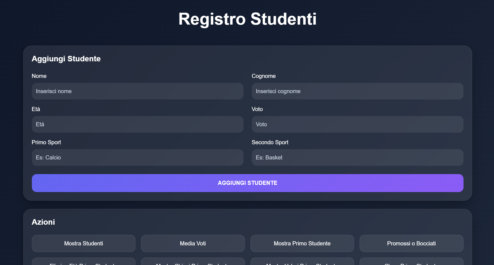
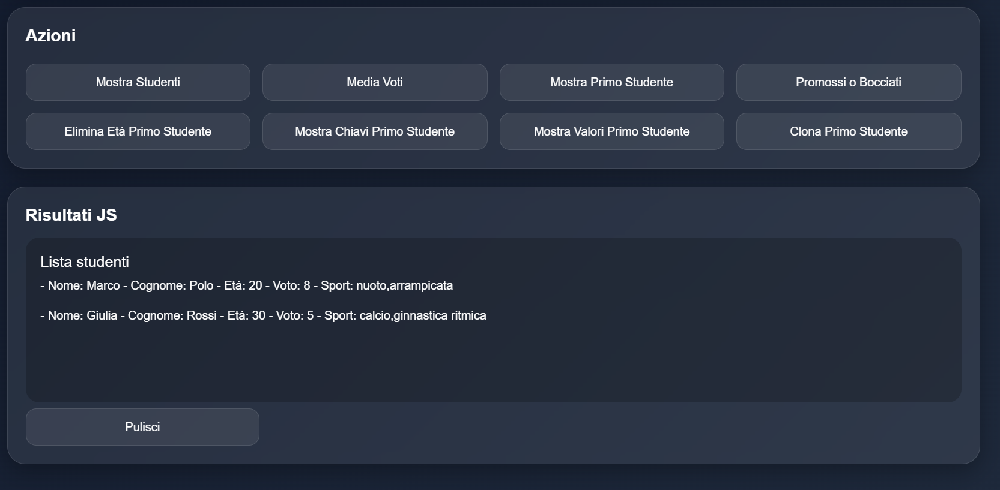

# Registro Studenti

Piccolo progetto JavaScript per la gestione di un array di studenti tramite form HTML.

---

## Funzionalità

* Aggiunta di nuovi studenti tramite form
* Gestione array di oggetti
* Inserimento:

  * Nome
  * Cognome
  * Età
  * Voto
  * Sport praticati
* Visualizzazione dati in pagina
* Utilizzo di:

  * `addEventListener`
  * `push()`
  * array e oggetti
  * manipolazione DOM

---

## Tecnologie utilizzate

* HTML5
* CSS3
* JavaScript Vanilla
* Bootstrap 5

---

## Screenshot

---

---

## Obiettivi del progetto

Questo progetto è stato realizzato per esercitarsi con:

* gestione di array di oggetti
* eventi JavaScript
* manipolazione del DOM
* utilizzo dei form
* organizzazione del codice frontend

---

